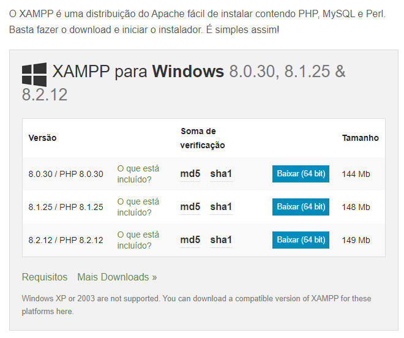

# Estágio Ribeirão Preto - 2024


O desafio consistia em cinco questões de lógica de programação. Os candidatos precisavam resolver problemas como cálculo de Fibonacci, soma de múltiplos, ordenação de arrays e verificação de números primos. Tive a oportunidade de aplicar meus estudos em PHP.


# Rodando localmente
```bash
  git clone https://github.com/ViniciusERF/desafio-target
```
### 1 - download o XAMPP

XAMPP é um pacote com os principais servidores de código aberto do mercado, incluindo FTP, banco de dados MySQL e Apache com suporte as linguagens PHP e Perl.

### 2 - Arquivo no diretório htdocs

Clique no botão Explorer no lado direito da janela para abrir um navegador de arquivos diretamente para a pasta XAMPP. Adicione a pasta do projeto neste diretório.

### 3 - Inicializando o Apache

Após encaminhar o projeto até o diretório "htdocs", de um Start (Iniciar) no Apache.

### 4 - Acessando servidor local #

Nessa etapa há duas maneiras de visualizarmos o projeto.

- Clicar em "Admin" ao lado do botão Start do Apache, e substituir essa URL "http://localhost/dashboard/" por essa "http://localhost/pwii/index.php"

- Acessar seu navegador de preferência e colocar esse caminho na URL "http://localhost/pwii/index.php"

### 5 - Desafio Target

Podemos testar as questões "2" e "5" 

- 2 - Sequência de Fibonacci.
- 5 - Inversão de String.
